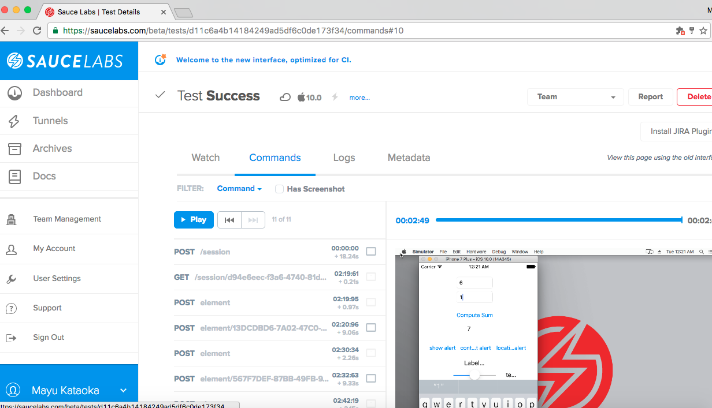
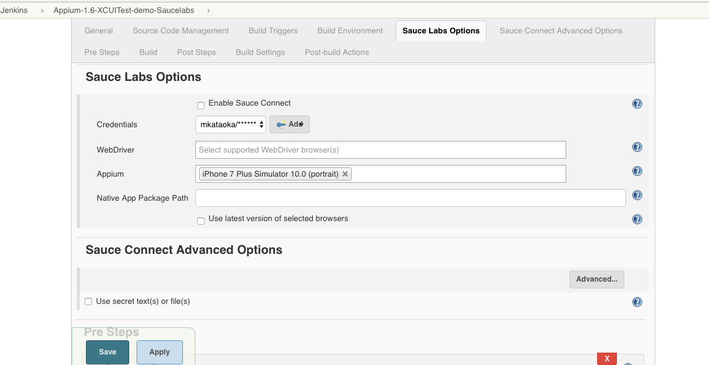
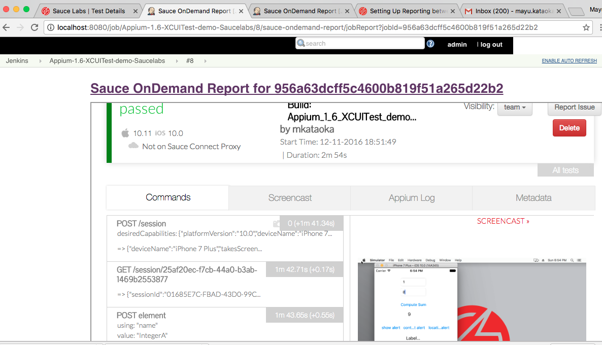

##Appium-1.6-XCUITest-demo

I created a sample iOS Appium test with Java. 
I could not find a sample code for the newly announced 1.6 Appium in December 2016. 
So I updated the old non-functional sample code originally written by Saucelabs and made it work with
the latest Appium 1.6. Verified the test execution with iOS SDK 10.0 and iOS simulator iphone plus 7 on SauceLabs. 
I also got the test running against Saucelab devices on Jenkins. 
I attached the Jenkins Saucelab config screenshots at the end of this Readme file. 

##To compile and run all tests, run:

    mvn test

##To run a single test, run:

    mvn -Dtest=com.saucelabs.appium.SimpleTest test

##How to set up the SauceLab authentication before running the test.

Add the following to your .bash_profile.

    export SAUCE_USERNAME=<your User Name>
    export SAUCE_ACCESS_KEY=<Your key>

This is needed if you are running your tests locally.

##Here is the output from Saucelabs.

##Here is how I configured Saucelabs in my Jenkins job.

##Here are the Jenkins plugins I used

Git plugin, Junit plugin, Sauce OnDemand Plugin
 
##Here is how the Sauce Labs Test Publisher on Jenkins looks like.

## How to upload the app to Saucelab storage

If your test job is separate from the main job, use Copy Artifact Plugin to get the app or ipa. Using the method described in https://wiki.saucelabs.com/display/DOCS/Uploading+Mobile+Applications+to+Sauce+Storage+for+Testing, upload the app to Sauce Storage. 
   
## Can I run the 1.6 Appium tests on Amazon Device Farm? 

Not yet. As of 12/11/2016, Device Farm supports Appium version 1.4.16 (1.3.6 for iOS 6-7). https://docs.aws.amazon.com/devicefarm/latest/developerguide/test-types-ios-appium-java-junit.html

